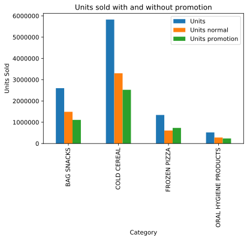
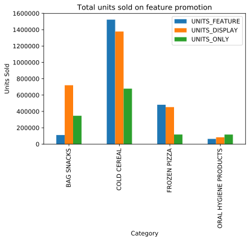
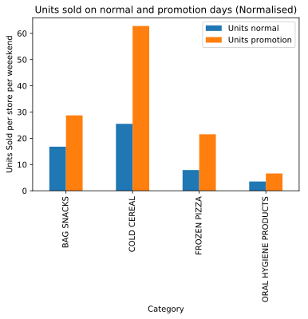
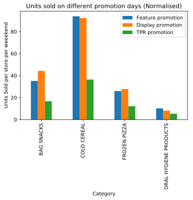
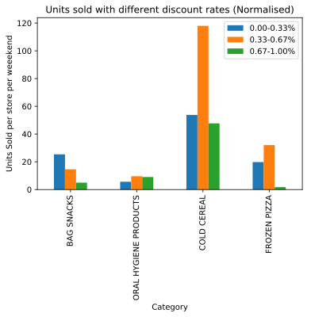

Discounts and promotions are pivotal in steering customers towards stores, and indeed have a substantial impact on sales and margins. We have all seen those massive Black Friday (and like in various different parts of the world) sales, where stores are teeming with people. Intuitively, one is convinced that a price reduction has a psychological impact on customers, and helps retailers either get rid of the products on the course of their obsolescence or earn brute margins by virtue of increased sales figures. By means of the following analysis, we have tried to delve deeper into the impact of discounts not only on sales but also on people belonging to different categories. 

## Impact of discounts on sales

To study the impact of sales, we analysed the weekend sales of products belonging to different categories over a period of one year. We higlight that no specific brands were analysed. Rather, differnt brands were bunduled up in the follwoing four categories.

      Bag Snacks 
      Cold Cereal
      Frozen Pizza
      Oral Hygiene
           
  Furthermore, the discounts provided by the stores are of three different types:   
  
1. **Feature discount**: product was is in-store circular,
2. **Display discount**: product was a part of an in-store circular, and
3. **TPR discount**: temporary price reduction only (i.e., shelf tag only. Product's price was reduced but was not on display or in an advertisement)
                      
####  Total sale, sale in discount period, sale in normal period per category

The figures below show the cummulative sale of the products across multiple categories. 

 
Regardless of how counterintuitive and incongruous it may appear, more units are sold on normal days than on promotion days. In addition, feature and display discounts taken seperately sell far more units as compared to TPR discount, which is in line with the anticipated behaviour. Tellingly, the units publicised heavily in in-store circulars and finding their way on store display boards are likely to sell more than the ones whose price reduction appears in some random shelf of an aisle.   

### Normalised sales

The above figures can be misleading- for one, the only take into account solely the absolute sales numbers. The results may be skewed as the number of promotion and non-promotion days is discarded. Moroever, the number of stores a type of promotion was featured in is also cast aside in the cummulative sales figures. In conclusion, it is important to normalise the sales to do way with the aforementioned limitations.

#### How discount percentages impact sales

# How advertising campaigns impact the different categories people?

In this section we are going to analyze how discounts impact people's shop habits.
We shall look at these habits from 2 different perspective: the status of the person 
(owner or renter) and the composition of the person's family.
These two categories are defining for this part of the analysis since they offer a way to
split our people into groups that might have different habits. Intuitively we expect to see
that people those people who are renters and those who have families to spend use more discount
tickets.

## Influence of discounts over renters and owners

As we can below, the number of renters is much smaller than the number of owner. In order to have a fair
comparison we shall look at the normalised values.

    Age     Number of owners    Number of renters
    19-24       13                  8
    25-34       75                  11
    35-44       130                 15
    45-54       194                 15
    55-64       44                  2
    65+         59                  2

Looking at the normalised plots from above we see that owners use more discount coupons than renters when they pay
for products. The only age category where renters use more is for people between 19-24 years old, which seems fair
if you are young, you have a rent and want to save money.
This makes us think that most of the owners with age between 25-64 years have families and might have a more regular
buying habit that renters.

### What kind of people redeemed the coupons and on what kind of products

We saw in the previous plots that renters are much less than the owners and that owner redeem and
that owners redeem much more discount tickets, which is not what we expected to see in the first instance.
Since owners between 25-64 years redeem much more tickets that the others, in this section we shall look at what
kind of families these people come from.

    Owners families
    1 Adult with Kids                   25
    2 Adults with Kids                  146
    2 Adults without Kids               206
    Single Female                       63
    Single Male                         38
    Unknown                             37

Above we can see some numbers that start to explain the intuition before, that most of the people have families
regardless they have kids or not. We see that most of the redeemed tickets come from families, but because their
number is dominant we shall have again a look at both the casual and the normalized plot.
In order to have a better understanding about how people use their tickets, we can observe bellow the number of
transactions for every category of products.

There are many categories of products, many of them quite similar, so we grouped the similar ones into higher
categories. In the following analysis we chose five basic categories of products that every household has. 
In the left we have the higher categories grouping considered during the analysis and on the right we have the
departments of products as they appear in the dataset: 
* Groceries - GROCERY, PASTRY, GRO BAKERY, PASTRY, FROZEN GROCERY
* Meat - MEAT-PCKGD, MEAT, MEAT-WHSE, PORK
* Seafood - SEAFOOD-PCKGD, SEAFOOD
* Medicines - DRUG GM, PHARMACY SUPPLY
* Nutrition - NUTRITION

    <b>Most popular product categories people use discount tickets on</b>

We can see that people use most of their discount tickets on groceries. Every person regardless the family type
has the peak on the transactions that involve groceries.

People that come from families with 1 parent and kids use considerably more discount tickets tickets
than people from other types of families, which makes perfect sense if you are the only parent nd you have kids
it would be in your interest to use discounts to buy products cheaper.

People from families with two adults with/ without kids do not redeem so much tickets as expected. There might be
two reasons for this behavior: they either have a more balanced behavior when it comes about shopping, they shop
less, but when they do they redeem tickets or they do not seem interested in using tickets. If we look at the
distribution of coupons redeemed we can draw the conclusion the high number of redeemed tickets comes indeed
from the high number of people with families and that they do not seem as interested in using tickets as the others.

Women take care of what they eat much more than men do. Women tend to use a comparable amount of discount on
groceries, more on seafood and meat and much less on nutrition products that contain unhealthy products like chips,
juice, sugar based products. These kind of products are avoided by women.
