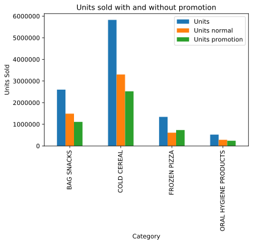
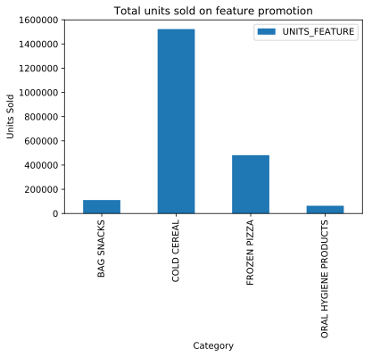
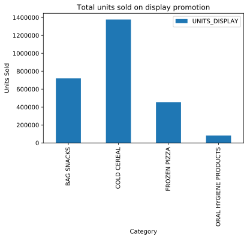
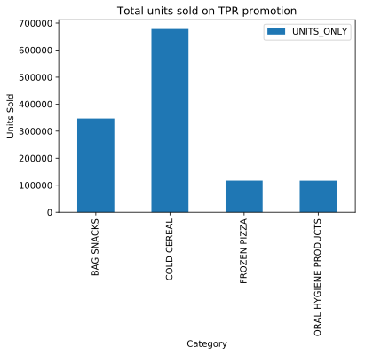
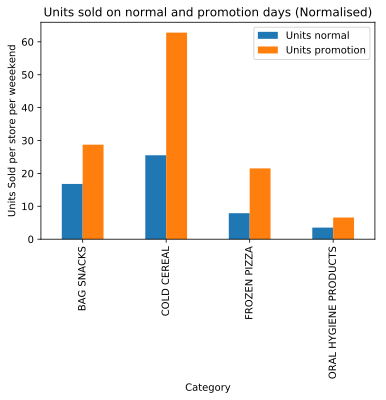
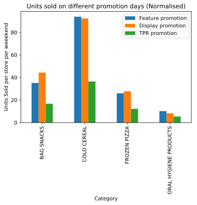
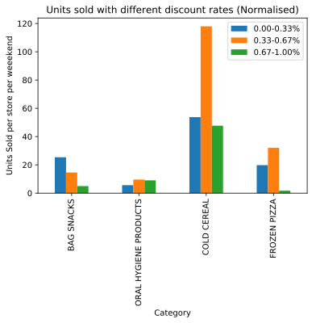

## How advertising campaigns impact the different categories people?

<table border="1" class="dataframe">
  <thead>
    <tr style="text-align: right;">
      <th></th>
      <th>UPC</th>
      <th>DESCRIPTION</th>
      <th>MANUFACTURER</th>
      <th>CATEGORY</th>
      <th>SUB_CATEGORY</th>
      <th>PRODUCT_SIZE</th>
    </tr>
  </thead>
  <tbody>
    <tr>
      <th>0</th>
      <td>1111009477</td>
      <td>PL MINI TWIST PRETZELS</td>
      <td>PRIVATE LABEL</td>
      <td>BAG SNACKS</td>
      <td>PRETZELS</td>
      <td>15 OZ</td>
    </tr>
    <tr>
      <th>1</th>
      <td>1111009497</td>
      <td>PL PRETZEL STICKS</td>
      <td>PRIVATE LABEL</td>
      <td>BAG SNACKS</td>
      <td>PRETZELS</td>
      <td>15 OZ</td>
    </tr>
    <tr>
      <th>2</th>
      <td>1111009507</td>
      <td>PL TWIST PRETZELS</td>
      <td>PRIVATE LABEL</td>
      <td>BAG SNACKS</td>
      <td>PRETZELS</td>
      <td>15 OZ</td>
    </tr>
    <tr>
      <th>3</th>
      <td>1111035398</td>
      <td>PL BL MINT ANTSPTC RINSE</td>
      <td>PRIVATE LABEL</td>
      <td>ORAL HYGIENE PRODUCTS</td>
      <td>MOUTHWASHES (ANTISEPTIC)</td>
      <td>1.5 LT</td>
    </tr>
    <tr>
      <th>4</th>
      <td>1111038078</td>
      <td>PL BL MINT ANTSPTC RINSE</td>
      <td>PRIVATE LABEL</td>
      <td>ORAL HYGIENE PRODUCTS</td>
      <td>MOUTHWASHES (ANTISEPTIC)</td>
      <td>500 ML</td>
    </tr>
  </tbody>
</table>

<table border="1" class="dataframe">
  <thead>
    <tr style="text-align: right;">
      <th></th>
      <th>WEEK_END_DATE</th>
      <th>STORE_NUM</th>
      <th>UPC</th>
      <th>UNITS</th>
      <th>VISITS</th>
      <th>HHS</th>
      <th>SPEND</th>
      <th>PRICE</th>
      <th>BASE_PRICE</th>
      <th>FEATURE</th>
      <th>DISPLAY</th>
      <th>TPR_ONLY</th>
    </tr>
  </thead>
  <tbody>
    <tr>
      <th>0</th>
      <td>2009-01-14 00:00:00</td>
      <td>367</td>
      <td>1111009477</td>
      <td>13</td>
      <td>13</td>
      <td>13</td>
      <td>18.07</td>
      <td>1.39</td>
      <td>1.57</td>
      <td>0</td>
      <td>0</td>
      <td>1</td>
    </tr>
    <tr>
      <th>1</th>
      <td>2009-01-14 00:00:00</td>
      <td>367</td>
      <td>1111009497</td>
      <td>20</td>
      <td>18</td>
      <td>18</td>
      <td>27.80</td>
      <td>1.39</td>
      <td>1.39</td>
      <td>0</td>
      <td>0</td>
      <td>0</td>
    </tr>
    <tr>
      <th>2</th>
      <td>2009-01-14 00:00:00</td>
      <td>367</td>
      <td>1111009507</td>
      <td>14</td>
      <td>14</td>
      <td>14</td>
      <td>19.32</td>
      <td>1.38</td>
      <td>1.38</td>
      <td>0</td>
      <td>0</td>
      <td>0</td>
    </tr>
    <tr>
      <th>3</th>
      <td>2009-01-14 00:00:00</td>
      <td>367</td>
      <td>1111035398</td>
      <td>4</td>
      <td>3</td>
      <td>3</td>
      <td>14.00</td>
      <td>3.50</td>
      <td>4.49</td>
      <td>0</td>
      <td>0</td>
      <td>1</td>
    </tr>
    <tr>
      <th>4</th>
      <td>2009-01-14 00:00:00</td>
      <td>367</td>
      <td>1111038078</td>
      <td>3</td>
      <td>3</td>
      <td>3</td>
      <td>7.50</td>
      <td>2.50</td>
      <td>2.50</td>
      <td>0</td>
      <td>0</td>
      <td>0</td>
    </tr>
  </tbody>
</table>

<table border="1" class="dataframe">
  <thead>
    <tr style="text-align: right;">
      <th></th>
      <th>STORE_ID</th>
      <th>STORE_NAME</th>
      <th>ADDRESS_CITY_NAME</th>
      <th>ADDRESS_STATE_PROV_CODE</th>
      <th>MSA_CODE</th>
      <th>SEG_VALUE_NAME</th>
      <th>PARKING_SPACE_QTY</th>
      <th>SALES_AREA_SIZE_NUM</th>
      <th>AVG_WEEKLY_BASKETS</th>
    </tr>
  </thead>
  <tbody>
    <tr>
      <th>0</th>
      <td>389</td>
      <td>SILVERLAKE</td>
      <td>ERLANGER</td>
      <td>KY</td>
      <td>17140</td>
      <td>MAINSTREAM</td>
      <td>408.0</td>
      <td>46073</td>
      <td>24766.807692</td>
    </tr>
    <tr>
      <th>1</th>
      <td>2277</td>
      <td>ANDERSON TOWNE CTR</td>
      <td>CINCINNATI</td>
      <td>OH</td>
      <td>17140</td>
      <td>UPSCALE</td>
      <td>NaN</td>
      <td>81958</td>
      <td>54052.519231</td>
    </tr>
    <tr>
      <th>2</th>
      <td>4259</td>
      <td>WARSAW AVENUE</td>
      <td>CINCINNATI</td>
      <td>OH</td>
      <td>17140</td>
      <td>VALUE</td>
      <td>NaN</td>
      <td>48813</td>
      <td>31177.333333</td>
    </tr>
    <tr>
      <th>3</th>
      <td>6379</td>
      <td>KINGWOOD</td>
      <td>KINGWOOD</td>
      <td>TX</td>
      <td>26420</td>
      <td>MAINSTREAM</td>
      <td>NaN</td>
      <td>50237</td>
      <td>20620.423077</td>
    </tr>
    <tr>
      <th>4</th>
      <td>6431</td>
      <td>AT WARD ROAD</td>
      <td>BAYTOWN</td>
      <td>TX</td>
      <td>26420</td>
      <td>VALUE</td>
      <td>350.0</td>
      <td>43698</td>
      <td>24321.942308</td>
    </tr>
  </tbody>
</table>

    array(['BAG SNACKS', 'ORAL HYGIENE PRODUCTS', 'COLD CEREAL',
           'FROZEN PIZZA'], dtype=object)

    156

<table border="1" class="dataframe">
  <thead>
    <tr style="text-align: right;">
      <th></th>
      <th>WEEK_END_DATE</th>
      <th>STORE_NUM</th>
      <th>UPC</th>
      <th>UNITS</th>
      <th>VISITS</th>
      <th>HHS</th>
      <th>SPEND</th>
      <th>PRICE</th>
      <th>BASE_PRICE</th>
      <th>FEATURE</th>
      <th>DISPLAY</th>
      <th>TPR_ONLY</th>
      <th>Discount</th>
      <th>Discount_Percentage</th>
    </tr>
  </thead>
  <tbody>
    <tr>
      <th>0</th>
      <td>2009-01-14 00:00:00</td>
      <td>367</td>
      <td>1111009477</td>
      <td>13</td>
      <td>13</td>
      <td>13</td>
      <td>18.07</td>
      <td>1.39</td>
      <td>1.57</td>
      <td>0</td>
      <td>0</td>
      <td>1</td>
      <td>1</td>
      <td>0.11465</td>
    </tr>
    <tr>
      <th>1</th>
      <td>2009-01-14 00:00:00</td>
      <td>367</td>
      <td>1111009497</td>
      <td>20</td>
      <td>18</td>
      <td>18</td>
      <td>27.80</td>
      <td>1.39</td>
      <td>1.39</td>
      <td>0</td>
      <td>0</td>
      <td>0</td>
      <td>0</td>
      <td>0.00000</td>
    </tr>
    <tr>
      <th>2</th>
      <td>2009-01-14 00:00:00</td>
      <td>367</td>
      <td>1111009507</td>
      <td>14</td>
      <td>14</td>
      <td>14</td>
      <td>19.32</td>
      <td>1.38</td>
      <td>1.38</td>
      <td>0</td>
      <td>0</td>
      <td>0</td>
      <td>0</td>
      <td>0.00000</td>
    </tr>
    <tr>
      <th>3</th>
      <td>2009-01-14 00:00:00</td>
      <td>367</td>
      <td>1111035398</td>
      <td>4</td>
      <td>3</td>
      <td>3</td>
      <td>14.00</td>
      <td>3.50</td>
      <td>4.49</td>
      <td>0</td>
      <td>0</td>
      <td>1</td>
      <td>1</td>
      <td>0.22049</td>
    </tr>
    <tr>
      <th>4</th>
      <td>2009-01-14 00:00:00</td>
      <td>367</td>
      <td>1111038078</td>
      <td>3</td>
      <td>3</td>
      <td>3</td>
      <td>7.50</td>
      <td>2.50</td>
      <td>2.50</td>
      <td>0</td>
      <td>0</td>
      <td>0</td>
      <td>0</td>
      <td>0.00000</td>
    </tr>
  </tbody>
</table>

####  Total sale, sale in dicount period, sale in normal period per category

<table border="1" class="dataframe">
  <thead>
    <tr style="text-align: right;">
      <th></th>
      <th>CATEGORY</th>
      <th>UNITS</th>
      <th>UNITS_NORMAL</th>
      <th>UNITS_DISC</th>
    </tr>
  </thead>
  <tbody>
    <tr>
      <th>0</th>
      <td>BAG SNACKS</td>
      <td>2601247</td>
      <td>1490290</td>
      <td>1110957</td>
    </tr>
    <tr>
      <th>1</th>
      <td>COLD CEREAL</td>
      <td>5826783</td>
      <td>3301659</td>
      <td>2525124</td>
    </tr>
    <tr>
      <th>2</th>
      <td>FROZEN PIZZA</td>
      <td>1341731</td>
      <td>609736</td>
      <td>731995</td>
    </tr>
    <tr>
      <th>3</th>
      <td>ORAL HYGIENE PRODUCTS</td>
      <td>521140</td>
      <td>282085</td>
      <td>239055</td>
    </tr>
  </tbody>
</table>

#### Sales by Feature, Display, or TPR_Only

### Normalised sales

<table border="1" class="dataframe">
  <thead>
    <tr style="text-align: right;">
      <th></th>
      <th>CATEGORY</th>
      <th>NORM_UNITS_NORMAL</th>
    </tr>
  </thead>
  <tbody>
    <tr>
      <th>0</th>
      <td>BAG SNACKS</td>
      <td>88718</td>
    </tr>
    <tr>
      <th>1</th>
      <td>COLD CEREAL</td>
      <td>129471</td>
    </tr>
    <tr>
      <th>2</th>
      <td>FROZEN PIZZA</td>
      <td>77149</td>
    </tr>
    <tr>
      <th>3</th>
      <td>ORAL HYGIENE PRODUCTS</td>
      <td>80203</td>
    </tr>
  </tbody>
</table>

<table border="1" class="dataframe">
  <thead>
    <tr style="text-align: right;">
      <th></th>
      <th>CATEGORY</th>
      <th>UNITS_NORMAL</th>
      <th>UNITS_DISC</th>
    </tr>
  </thead>
  <tbody>
    <tr>
      <th>0</th>
      <td>BAG SNACKS</td>
      <td>16.798057</td>
      <td>28.731399</td>
    </tr>
    <tr>
      <th>1</th>
      <td>COLD CEREAL</td>
      <td>25.501147</td>
      <td>62.804656</td>
    </tr>
    <tr>
      <th>2</th>
      <td>FROZEN PIZZA</td>
      <td>7.903356</td>
      <td>21.512182</td>
    </tr>
    <tr>
      <th>3</th>
      <td>ORAL HYGIENE PRODUCTS</td>
      <td>3.517138</td>
      <td>6.585356</td>
    </tr>
  </tbody>
</table>

#### Sales by Feature, Display, or TPR_Only (Normalised)

<table border="1" class="dataframe">
  <thead>
    <tr style="text-align: right;">
      <th></th>
      <th>CATEGORY</th>
      <th>UNITS_FEATURE</th>
      <th>UNITS_DISPLAY</th>
      <th>UNITS_ONLY</th>
    </tr>
  </thead>
  <tbody>
    <tr>
      <th>0</th>
      <td>BAG SNACKS</td>
      <td>35.140462</td>
      <td>44.315673</td>
      <td>16.704998</td>
    </tr>
    <tr>
      <th>1</th>
      <td>COLD CEREAL</td>
      <td>93.893280</td>
      <td>92.303022</td>
      <td>36.434502</td>
    </tr>
    <tr>
      <th>2</th>
      <td>FROZEN PIZZA</td>
      <td>25.967638</td>
      <td>27.746035</td>
      <td>12.197750</td>
    </tr>
    <tr>
      <th>3</th>
      <td>ORAL HYGIENE PRODUCTS</td>
      <td>10.210232</td>
      <td>8.182900</td>
      <td>5.366363</td>
    </tr>
  </tbody>
</table>

#### How discount percentages impact sales

<table border="1" class="dataframe">
  <thead>
    <tr style="text-align: right;">
      <th></th>
      <th>CATEGORY</th>
      <th>0.00-0.33%</th>
      <th>0.33-0.67%</th>
      <th>0.67-1.00%</th>
    </tr>
  </thead>
  <tbody>
    <tr>
      <th>0</th>
      <td>BAG SNACKS</td>
      <td>25.368228</td>
      <td>14.593081</td>
      <td>4.963636</td>
    </tr>
    <tr>
      <th>1</th>
      <td>ORAL HYGIENE PRODUCTS</td>
      <td>5.634873</td>
      <td>9.574208</td>
      <td>9.037037</td>
    </tr>
    <tr>
      <th>2</th>
      <td>COLD CEREAL</td>
      <td>53.763967</td>
      <td>118.007242</td>
      <td>47.705882</td>
    </tr>
    <tr>
      <th>3</th>
      <td>FROZEN PIZZA</td>
      <td>19.785781</td>
      <td>32.041645</td>
      <td>1.750000</td>
    </tr>
  </tbody>
</table>

# How frequency of discounts at a store effects sales  
