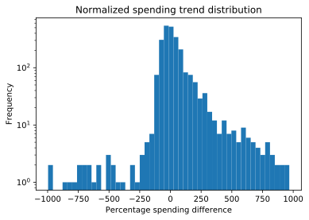

We analyzed how much people spend on shopping and how that value changes over time.

## Weekly spending

First we look at the mean household spending each week and see how it varies over time.

There is a high deviation between subsequent weeks, but we can see that the sales are increasing over time. The linear regression shows a rising trend.

## Monthly spending
To deal with the very high variance between weeks, we look at the spending within a longer time interval - one month.

The plot is much smoother and indeed we see an increasing trend, especially at the very beginning (in the first half of the fist year). After six months, the trend seems to still be rising, but it slows down a lot in comparison to the first months.

## Individual trends

However, people are not a nameless mass, but a group of individuals. The mean household spending seems to be rising, but does that mean that all the people are spending more and more? Let's find out.

We now try to fit a Linear Regression model to the weekly spending of each household. The fitted line represents a 'trend' in the spending of the household - if the line is going upwards the household is spending more, if it is downwards the household is spending less. A horizontal line means the spending stays about the same.

We compute a percentage spending change - we fit the line to weekly spending (to avoid the high variance, the line is an approximation of a long term tendency) and assume the line's height in the first week is the starting value and its height in the last week is the final value and compute the percentage difference between the two.

We have dropped some outliers from the data which were mostly households that did very few transactions. Given too few transactions the trend approximation was too imprecise to give good results.

The absolute spending trend is just the coefficient of the linear trend - it is very dependent on the initial value. If someone was spending 200k in the beginning and in the end they are spending 210k, the coefficient would be the same as in the case someone was spending 10k and started spending 20k, but in fact these changes are drastically different (5% vs 100% increase).

That is why we will now analyse the percentage change described earlier - it is a better metric in terms of habits. Because a 2x is very different from a 5% change.

    3.0

We checked that only 3% of samples are extreme outliers (with percentage bigger than 1000%), so we skipped them in the histograms for readability. They are likely caused by households doing few transactions and the trend approximation being imprecise with too few samples.

A positive value means the spending has increased - for example 100% means the spending is now twice as much as in the beginning, 0% means no change and -50% means the spending has decreased by 50% since the beginning.

Values smaller then -100% may look suspicious - what they represent is samples where there was not too much data so the approximated spending trend is indicating that at the end of the period they would be spending negative amounts, which is of course illogical.
We can however treat these values as large negative values, because these customers were spending much less over time.

    The median percentage difference is 2.79%, but the average is 32.45%

We can see that the mean is much bigger than the median - there are some people that have greatly increased their spending, but most people actually increased only slightly.

    12.41% of households have not changed their spending by more than 10%

    45.94% of households have increased their spending by 10% or more

    41.65% of households have decreased their spending by 10% or more

We can see that most people have indeed increased their spending, but almost as many have actually decreased it.

