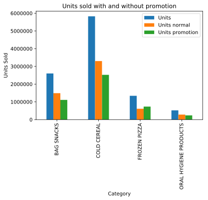
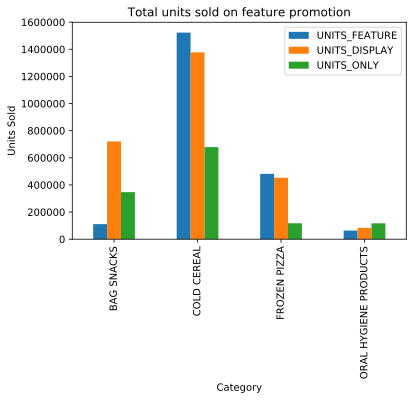
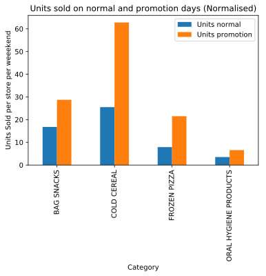
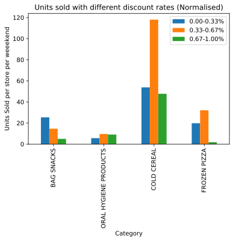

## How advertising campaigns impact the different categories people?

####  Total sale, sale in dicount period, sale in normal period per category

<table border="1" class="dataframe">
  <thead>
    <tr style="text-align: right;">
      <th></th>
      <th>CATEGORY</th>
      <th>UNITS</th>
      <th>UNITS_NORMAL</th>
      <th>UNITS_DISC</th>
    </tr>
  </thead>
  <tbody>
    <tr>
      <th>0</th>
      <td>BAG SNACKS</td>
      <td>2601247</td>
      <td>1490290</td>
      <td>1110957</td>
    </tr>
    <tr>
      <th>1</th>
      <td>COLD CEREAL</td>
      <td>5826783</td>
      <td>3301659</td>
      <td>2525124</td>
    </tr>
    <tr>
      <th>2</th>
      <td>FROZEN PIZZA</td>
      <td>1341731</td>
      <td>609736</td>
      <td>731995</td>
    </tr>
    <tr>
      <th>3</th>
      <td>ORAL HYGIENE PRODUCTS</td>
      <td>521140</td>
      <td>282085</td>
      <td>239055</td>
    </tr>
  </tbody>
</table>

#### Sales by Feature, Display, or TPR_Only

<table border="1" class="dataframe">
  <thead>
    <tr style="text-align: right;">
      <th></th>
      <th>CATEGORY</th>
      <th>UNITS_FEATURE</th>
      <th>UNITS_DISPLAY</th>
      <th>UNITS_ONLY</th>
    </tr>
  </thead>
  <tbody>
    <tr>
      <th>0</th>
      <td>BAG SNACKS</td>
      <td>111079</td>
      <td>720174</td>
      <td>346612</td>
    </tr>
    <tr>
      <th>1</th>
      <td>COLD CEREAL</td>
      <td>1522949</td>
      <td>1377438</td>
      <td>678374</td>
    </tr>
    <tr>
      <th>2</th>
      <td>FROZEN PIZZA</td>
      <td>481440</td>
      <td>453065</td>
      <td>117074</td>
    </tr>
    <tr>
      <th>3</th>
      <td>ORAL HYGIENE PRODUCTS</td>
      <td>63865</td>
      <td>83171</td>
      <td>116815</td>
    </tr>
  </tbody>
</table>

### Normalised sales

#### Sales by Feature, Display, or TPR_Only (Normalised)

#### How discount percentages impact sales

