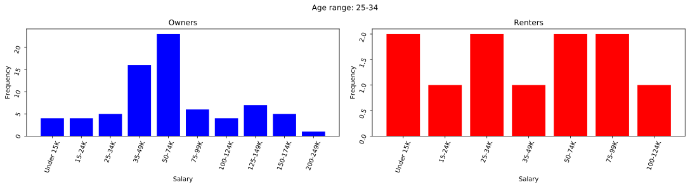
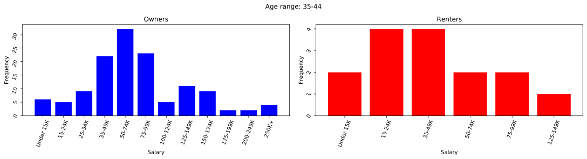
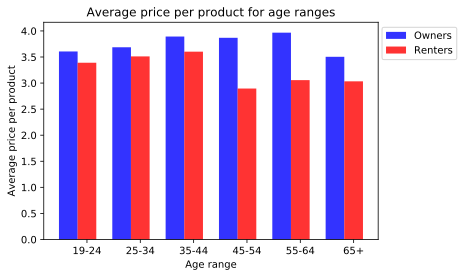
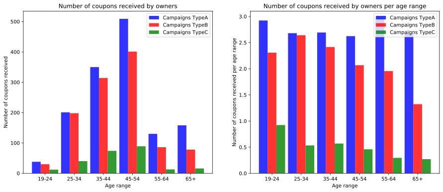
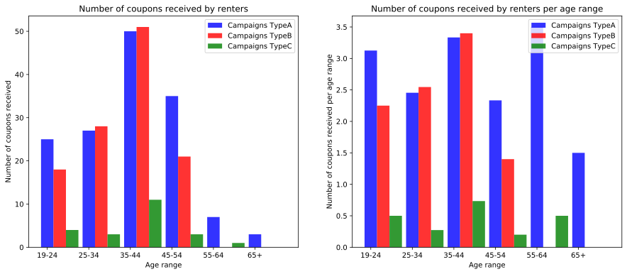

* Most of the people are owners and by looking at every age category we observe that their salaries are normally distributed. 
* From their salaries we expect to see that the average value of products bought by owners to be higher than the average value of products of renters

### Average price per transaction for all age ranges

* Indeed, we can see that owners tend to spend more money on products on all age ranges.
* It is worth noticing that this might be biased due to very big difference in numbers of between renteres and owners. **Renters represent aproximatively 10% of the total number of owners.**

### Influence of coupons over renters and owners

    Age Range
    19-24     8
    25-34    11
    35-44    15
    45-54    15
    55-64     2
    65+       2
    Name: Number of renters per age range, dtype: int64
    Age Range
    19-24    14
    25-34    24
    35-44    34
    45-54    22
    55-64     1
    Name: Number coupons redeemed per number of renters of age range, dtype: int64
    

* We see the proportions of coupons per age range are comparable even if the the numbers from people of differente ages are different.
* Also, looking at the at the 2 series from above the plots we see that none of the renters above 65 years old redeemed any coupon.

    Age Range
    19-24     13
    25-34     75
    35-44    130
    45-54    194
    55-64     44
    65+       59
    Name: Number of owners per age range, dtype: int64

* It is not worth comparing the number of coupons redeemed, because as we can see from the series from the above, the number of people within 45-54 years old is bigger than any number of people from any other age ranges. So we divide the number of coupons redeemed at the number of people from within the age range and we get the plot from the right.
* Now the comparison is a more fair as it emphasizes that the ratio of coupons redeemed by people between 55-64 years old is comparable with the other ratios (fact that was hardto guess from the first plot)
* An interesting observation would be the comparison between owners and renters for people between 19024 years old. Even though the number of people is quite the same, renters between 19-24 redeem 3 times more coupons than the owners within the same age, which is fair if you have a rent and want to save money.
* Looking at the above 4 plots we see that people like to use coupons and get cheaper products.

# Number of coupons received by onwers and renters

    Age Range
    19-24     13
    25-34     75
    35-44    130
    45-54    194
    55-64     44
    65+       59
    Name: Number of owners per age range, dtype: int64
    Age Range
    19-24     8
    25-34    11
    35-44    15
    45-54    15
    55-64     2
    65+       2
    Name: Number of owners per age range, dtype: int64
    

* Looking at the 2 plots from the left for both owners and renters we see that people with ages between 45-54 years old (for owners) and 35-44 years old (for owners) received more tickets because they are more than the othe peple in other catagories.
* Looking at the plots from the right, that denote the number of coupons in average received by a person within a certain age range, we see that the number of campaign people are advertised with does not seem to depend on the age, stores trying to win as more clients as possible.

# What kind of people redeemed the coupons and on what kind of products

We will look a little bit more in depth on how people spent the coupons depending on the families these come from

    HH_COMP_DESC
    1 Adult Kids         25
    2 Adults Kids       146
    2 Adults No Kids    206
    Single Female        63
    Single Male          38
    Unknown              37
    dtype: int64

* Indeed, we can see in the above plot that families that have kids redeem more coupons (looking at the bar with with **1 Adult Kids** and **2 Adults Kids**) as their number is bigger, so the comparison would not be fair without dividing by the number of households from every category.

    
* The second plot provides a more honest comparison as we can notice that despite there are far less transactions for families with only 1 parent (because they are much less than families with 2 parents) we see that they buy groceries much more frequent  than families with 2 adults (with or without kids)

    
* We see again the same behavior as in the plots for groceries, families with 1 adult buying more frequent than the others
* It is interesting to remark that signle females buy meat more frequently than men.

* The trend does not seem to change.

* The trend does not seem to change.

* We see that single males byt more nutrtion products than signle women. If we look at the list of unique products from nutrition category we see that these products are not so healthy (like FROZEN BURGERS, CANDY W/O FLOUR etc).
* It seem that single females pay more attention with when they are going to shopping than single men.
    
* Looking at the 8 plots above (number of transactions for **groceries**, **meat**, **seafod** and **medicine**) unnormalized (on the left) and normalized (on the right) we draw the conclusion that families with 2 adults (with and withou kids) have more balanced behavior when it comes about shopping. We can notice that by looking at the plots on the right that the frequency of transactions for these 2 groups is smalles than the frequqncy of transactions for the other groups.
* Single females tend to have the same frequency of buying with single men, though it is to remark that they buy healthier products (they have a higher freuqncy than single men when it comes about seafood and meat products, a comparable frequency of buying groceries and a smaller frquency of buying nutrition products which are mostly dominated by unhealthy products.
